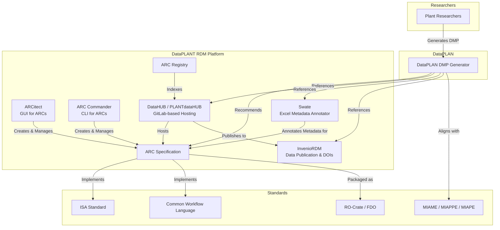

# DataPLAN

[](https://www.gnu.org/licenses/gpl-3.0)
[](https://doi.org/10.3390/data8110159)

**DataPLAN** is a user-friendly, serverless Data Management Plan (DMP) generator developed by [DataPLANT](https://nfdi4plants.org/). It simplifies the creation of DMPs for various research projects and funding programmes, including Horizon Europe, H2020, DFG, BMBF, BMEL, BBSRC, NSF, MSCA, Carl-Zeiss, and more.

The tool incorporates prewritten DMP content tailored for the plant sciences, while aligning with FAIR principles and minimal information standards (MIAME, MinSEQe, MIAPE, MSI, MIAPPE). Users answer wizard-style questions through checkboxes and input fields; the answers are automatically inserted into the selected DMP template and can be exported as **Word documents** or **machine-actionable maDMP (JSON)**.

A quick introduction is available in this [two-minute video](https://www.youtube.com/watch?v=T40Kmah1RTY):

[](https://www.youtube.com/watch?v=T40Kmah1RTY)

---

## Table of Contents

- [Usage](#usage)
- [Features](#features)
- [Saving & Sharing Your Answers](#saving--sharing-your-answers)
- [Development](#development)
  - [Prerequisites](#prerequisites)
  - [Local Setup](#local-setup)
  - [Running Tests](#running-tests)
- [DataPLANT Ecosystem](#dataplant-ecosystem)
- [Folder Structure](#folder-structure)
- [Publication](#publication)
- [License](#license)
- [Libraries and Tools](#libraries-and-tools)

---

## Usage

### Online
Visit **[plan.nfdi4plants.org](https://plan.nfdi4plants.org)** to use DataPLAN directly in your browser. No installation or account is required.

### Offline
1. Download the repository as a [ZIP file](https://github.com/nfdi4plants/dataplan/archive/refs/heads/main.zip) or clone it:
   ```bash
   git clone https://github.com/nfdi4plants/dataplan.git
   ```
2. Open `index.html` in any modern web browser.

> **Note:** DataPLAN is a purely client-side application. All data processing happens in your browser; no server backend is needed.

---

## Features

- **Template-based DMP generation** – Prewritten templates for major funders (Horizon Europe, DFG, BMBF, NSF, BBSRC, etc.) with plant-science-specific defaults.
- **Wizard-style UI** – Checkboxes and input fields guide users through each DMP section.
- **Live preview** – See how answers populate the template in real time.
- **Multiple export formats** – Download the finished DMP as a Word document (`.docx`) or as a machine-actionable maDMP (`.json`).
- **Embedded maDMP editor** – Edit and validate machine-actionable DMP JSON before exporting.
- **Data type awareness** – Recommendations adapt based on selected data types (genomics, transcriptomics, metabolomics, phenotyping, etc.).
- **FAIR-by-design** – Built-in references to DataPLANT RDM tools, ontologies, endpoint repositories, and minimal information standards.

---

## Saving & Sharing Your Answers

- **Automatic Storage** – Your answers are automatically saved in your browser's `localStorage`.
- **Cross-Device Use** – Export your progress as a JSON file and import it on another browser or device to continue editing.
- **maDMP Export** – Generate a machine-actionable DMP in RDA maDMP format for interoperability with other tools and repositories.

---

## Development

### Prerequisites

- A modern web browser (Chrome, Firefox, Edge, Safari)
- A local HTTP server (recommended for development and testing)
- [Node.js](https://nodejs.org/) (only required for running Cypress end-to-end tests)

### Local Setup

Because modern browsers enforce CORS restrictions on `file://` URLs for modules and some APIs, serve the project via a local HTTP server:

```bash
# Using Python 3
python -m http.server 8000

# Using Node.js (npx serve)
npx serve -l 8000

# Using PHP
php -S localhost:8000
```

Then open [http://localhost:8000](http://localhost:8000) in your browser.

### Running Tests

DataPLAN uses [Cypress](https://www.cypress.io/) for end-to-end testing.

```bash
# Install Cypress (if not already installed)
npm install cypress --save-dev

# Open the Cypress Test Runner
npx cypress open

# Or run tests headlessly
npx cypress run
```

Test configuration is located in `cypress/cypress.config.js`. The base URL is expected to be `http://127.0.0.1:8000/`.

---

## DataPLANT Ecosystem

DataPLAN is one component of the broader [DataPLANT](https://nfdi4plants.org/) research data management (RDM) ecosystem for fundamental plant research. The diagram below illustrates how DataPLAN relates to other DataPLANT tools and services.



### Upstream / Downstream Relationships

| Repository / Service | Relationship | Description |
|----------------------|--------------|-------------|
| [ARC Specification](https://github.com/nfdi4plants/ARC-specification) | **Downstream reference** | DataPLAN DMPs recommend the Annotated Research Context (ARC) as a FAIR data structure. |
| [ARCitect](https://github.com/nfdi4plants/ARCitect) | **Downstream reference** | DataPLAN mentions ARCitect as the GUI tool for building ARCs. |
| [ARC Commander](https://github.com/nfdi4plants/arcCommander) | **Downstream reference** | DataPLAN mentions ARC Commander as the CLI tool for ARC management. |
| [Swate](https://github.com/nfdi4plants/Swate) | **Downstream reference** | DataPLAN recommends Swate for metadata annotation in the DMP. |
| [DataHUB](https://git.nfdi4plants.org) / PLANTdataHUB | **Downstream reference** | DataPLAN references DataHUB as the platform for data storage and collaboration. |
| [InvenioRDM](https://github.com/inveniosoftware) | **Downstream reference** | DataPLAN references InvenioRDM-connected services for data publication and DOI assignment. |
| [nfdi4plants.knowledgebase](https://github.com/nfdi4plants/nfdi4plants.knowledgebase) | **Sibling / Cross-reference** | The Knowledge Base provides documentation and training materials that complement DataPLAN. |

### How DataPLAN Fits In

1. **Planning Phase** – Researchers use DataPLAN to draft a DMP before starting a project. The DMP already includes references to DataPLANT tools (ARC, Swate, DataHUB) and standards (MIAPPE, ISA).
2. **Execution Phase** – Researchers follow the DMP by creating ARCs with ARCitect or ARC Commander, annotating metadata with Swate, and syncing to the DataHUB.
3. **Publication Phase** – Completed datasets are published via the DataHUB-connected InvenioRDM instance, receiving DOIs and becoming findable through the ARC Registry.

---

## Folder Structure

| Path | Description |
|------|-------------|
| `index.html` | Main application entry point |
| `template.html` | Template page for standalone DMP rendering |
| `/js/` | JavaScript modules (main logic, exports, maDMP handling, tours) |
| `/css/` | Bootstrap 5 custom stylesheets |
| `/DMPDocs/` | DMP template definitions for each funder (JavaScript-based templates) |
| `/tools/madmp-editor/` | Embedded machine-actionable DMP (maDMP) JSON editor and validator |
| `/cypress/` | End-to-end Cypress tests |
| `/files/` | Bibliography and reference files (`.bib`, `.ris`, `.csv`) |
| `/images/` | Cover image, logo, and other assets |
| `citation.cff` | Citation metadata (CFF format) |

---

## Publication

DataPLAN is featured as an issue cover in the journal *Data*:

[](https://www.mdpi.com/2306-5729/8/11/159)

> **Citation:** Zhou, X.; Usadel, B.; Kranz, A. DataPLAN: A Web-Based Data Management Plan Generator for the Plant Sciences. *Data* **2023**, *8*, 159. [https://doi.org/10.3390/data8110159](https://doi.org/10.3390/data8110159)

---

## License

This project is licensed under the [GPL-3.0 License](https://www.gnu.org/licenses/gpl-3.0.en.html).

---

## Libraries and Tools

DataPLAN leverages several open-source projects:

- **UI Framework:** [Bootstrap 5](https://getbootstrap.com/)
- **Onboarding Tours:** [bs5-intro-tour](https://github.com/yaras6/bs5-intro-tour)
- **Word Cloud Visualization:** [d3.js](https://d3js.org/) & [d3-cloud](https://github.com/jasondavies/d3-cloud)
- **File Downloads:** [FileSaver.js](https://github.com/eligrey/FileSaver.js/)
- **JSON Validation:** [AJV](https://ajv.js.org/) (via `tools/madmp-editor/`)
- **Testing:** [Cypress](https://www.cypress.io/)

Thanks to these communities for their contributions!
